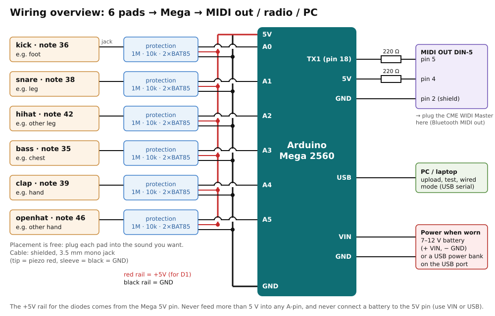

# beat-corn

Wearable body percussion: piezo sensors on the feet, chest, legs and hands turn
body hits into MIDI drum notes, sent by radio to a sampler that plays beatbox
sounds.

```
piezo pads ──> protection board ──> Arduino Mega ──> MIDI ──> radio ──> PC ──> Hydrogen (beatbox kit)
(on the body)   (keeps the Mega alive)  (hit detection)      (or USB cable for testing)
```

Each input plays one fixed sound. Where a pad goes on the body is up to you: plug
it into the input of the sound you want it to play.

| Pin | Sound | MIDI note | Suggested placement |
|-----|-------|-----------|---------------------|
| A0 | kick | 36 | foot (heel stomp) |
| A1 | snare | 38 | leg / thigh |
| A2 | hihat | 42 | other leg |
| A3 | bass | 35 | chest |
| A4 | clap | 39 | hand |
| A5 | openhat | 46 | other hand |

Notes follow the General MIDI drum map, so any drum sampler works out of the box.



> **Never wire a piezo directly to an analog pin.** A stomp produces tens of volts;
> the pin tolerates −0.5 … 5.5 V. Each input needs the 4-part protection circuit
> described in [docs/hardware.md](docs/hardware.md).

## Documentation

- [docs/hardware.md](docs/hardware.md): protection circuit, parts list, building and
  testing the board, making the pads, power and safety, MIDI DIN out
- [docs/firmware.md](docs/firmware.md): output modes, pad settings, calibration, tuning
- [docs/sampler.md](docs/sampler.md): getting MIDI into the PC, Hydrogen setup, making
  the beatbox kit, latency

## Quick start

1. Build the protection board and **check it with a multimeter before connecting it**
   ([hardware.md](docs/hardware.md#check-before-plugging-into-the-mega)).
2. Upload with `CALIBRATE 1`, set each pad's `threshold`/`maxLevel` from the Serial
   Plotter ([firmware.md](docs/firmware.md#calibration-procedure)).
3. Upload with `CALIBRATE 0` and `MIDI_MODE_DISPLAY`, check hits in the Serial Monitor.
4. Switch to `MIDI_MODE_USB_SERIAL`, run the bridge, play GMRockKit in Hydrogen
   ([sampler.md](docs/sampler.md)).
5. Record beatbox samples, build the kit with `tools/make_hydrogen_kit.py`.
6. Switch to `MIDI_MODE_SERIAL`, plug in the radio, run on battery.

## Files

```
beat-corn.ino                  firmware (Arduino Mega 2560)
tools/serial_midi_bridge.py    USB/radio serial port -> ALSA MIDI port
tools/make_hydrogen_kit.py     samples/ folder -> Hydrogen drumkit
docs/                          documentation and schematics (SVG)
attic/                         the original Blink/MIDI test sketch
```
