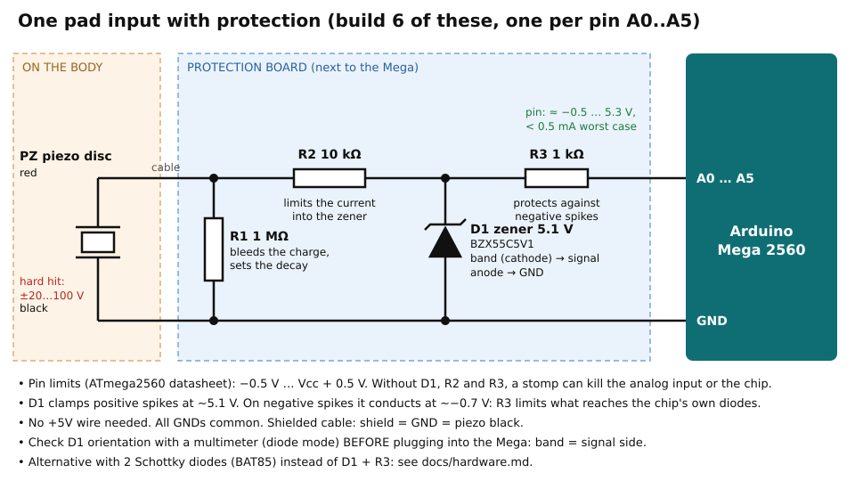

# Hardware

How to build the pads, the protection board, and wire them to the Arduino Mega
without damaging it.


## Why the protection is mandatory

A piezo disc is a voltage generator. A soft tap gives a few hundred millivolts,
but a hand slap gives 10–20 V and a foot stomp can exceed 50–100 V for a fraction
of a millisecond, in both polarities.

The ATmega2560 datasheet limits any I/O pin to **−0.5 V … Vcc + 0.5 V** (−0.5 … 5.5 V).
Wiring a piezo straight to an analog pin works for a while, because the chip's
internal clamp diodes absorb the spikes. Each stomp stresses them, though, and
they eventually fail. The first symptom is usually one analog input reading wrong,
or the whole ADC drifting. A strong enough spike can also latch up the chip.

The protection below keeps every analog pin inside its limits, whatever the
piezo does.

## Protection circuit (one per pad)



```
piezo red ──┬──[ R2 10k ]──┬──[ R3 1k ]──> A0..A5
            │              │
          R1 1M         D1 zener 5.1 V (BZX55C5V1), band → signal
            │              │
piezo black ┴──────────────┴─────────────> GND
```

| Part | Value | Role |
|------|-------|------|
| R1 | 1 MΩ | Across the piezo. Drains its charge so the signal returns to 0 V between hits, and sets how fast the pulse decays. Lower values (470 kΩ) give a shorter pulse and less sensitivity. |
| R2 | 10 kΩ | In series. Limits the current into the zener on a big spike (100 V / 10 kΩ = 10 mA, for well under a millisecond). |
| D1 | BZX55C5V1 zener, 5.1 V | Band (cathode) on the signal, anode on GND. Positive spikes: conducts at ~5.1 V. Negative spikes: conducts forward at ~−0.7 V. |
| R3 | 1 kΩ | Between the zener and the pin. The zener's −0.7 V is a bit past the pin's −0.5 V limit, so the chip's own protection diodes conduct a little: R3 keeps that current under ~0.5 mA, which they handle forever. It also covers the zener's tolerance (4.8–5.4 V) on the positive side. |

Notes:

- **Check the zener's value before soldering it.** In an assortment pack they all
  look the same: read the tiny print on the glass body (`5V1` / `C5V1`), or test it:
  9 V battery → 1 kΩ → zener (band towards +) → battery −, and measure about 5.1 V across
  the zener. A 12 V zener by mistake gives **no protection at all**.
- A **4.7 V zener** (`4V7`, likely in your pack) works too, with more safety margin, but it
  starts compressing loud hits earlier.
- A zener starts leaking softly from about 4 V, so very loud hits are slightly
  compressed near the top of the range. Calibration takes care of it: `maxLevel`
  will end up around 800–900 rather than 1023.
- No +5V wire is needed: everything is between the signal and GND.

### Alternative: two Schottky diodes

If you have BAT85 (or BAT43, 1N5817, BAT54S) Schottky diodes, they make a sharper
clamp: replace D1 and R3 with **D1 from the signal to +5V (band to +5V)** and **D2
from GND to the signal (band to the signal)**. Schottky diodes conduct at ~0.3 V,
before the chip's own diodes, so R3 isn't needed, but the board then needs a +5V
wire from the Mega's 5V pin. Regular silicon diodes (1N4148) are **not** a
substitute: they conduct at 0.6–0.7 V, like the zener, so they'd still need R3.

## Bill of materials

Per pad (×6):

| Qty | Part |
|-----|------|
| 1 | Piezo disc, 27 mm, with leads (e.g. Timesetl) |
| 1 | 1 MΩ resistor, ¼ W |
| 1 | 10 kΩ resistor, ¼ W |
| 1 | 1 kΩ resistor, ¼ W |
| 1 | BZX55C5V1 zener diode (5.1 V, 0.5 W) |
| 1 | 3.5 mm mono jack socket (panel or PCB) and a mono plug |
| ~1.5 m | thin shielded cable (1 core + shield), or a twisted pair |
| 1 | rigid plate 40–60 mm (2–3 mm acrylic or PCB offcut) and 3–5 mm neoprene or EVA foam |

Shared:

| Qty | Part |
|-----|------|
| 1 | Arduino Mega 2560 |
| 1 | Perfboard or a Mega proto shield for the protection board |
| 1 | 5-pin DIN female socket + 2 × 220 Ω (MIDI OUT for the WIDI Master) |
| 1 | CME WIDI Master (Bluetooth MIDI radio, powered by the MIDI OUT) |
| 1 | Power when worn: 9 V battery with a barrel plug, or a USB power bank |
| | Velcro/elastic straps, phone armbands, a chest strap, fingerless gloves; double-sided tape, epoxy or hot glue, Kapton tape |

## Building the protection board

1. Run a **GND** rail along the board (black wire to a Mega GND pin).
2. For each channel solder R1, R2, D1 and R3 as in the schematic. Mind the **band**
   on the zener: it goes to the signal side (the R2/R3 junction), the other end to GND.
3. Wire each jack: tip to the R1/R2 junction, sleeve to GND.
4. Wire each channel output (the far end of R3) to A0 … A5.

### Check before plugging into the Mega

Do this with the board **not connected** to the Mega, using a multimeter:

1. **Diode mode, each channel**, probes on the zener's two ends (R2/R3 junction and GND):
   - red probe on *GND*, black on the junction → about 0.6–0.8 V (zener conducts forward)
   - red on the junction, black on *GND* → OL (a meter's diode test can't reach 5.1 V)
   If you read ~0 V either way, the zener is shorted or there's a solder bridge. If you
   read ~0.7 V the other way round, the zener is reversed.
2. **Resistance from tip to GND** (piezo unplugged): about 1 MΩ.
3. **Resistance from tip to the channel output**: about 11 kΩ (R2 + R3).
4. **No short between neighbouring channels**: resistance between two outputs is high.

Then connect the board, power the Mega from USB, start with `CALIBRATE 1` and
**tap softly first**.

## The pads

The pads use **27 mm piezo discs** (brass disc with a ~20 mm ceramic layer, leads
pre-soldered, like the Timesetl packs). That's the common size for DIY drum
triggers: small enough for hands and ankles, and plenty of signal for body hits.

### How a piezo disc works (and breaks)

- It produces a voltage when it **bends**. A hit bends the plate it is glued to,
  which bends the disc: that's the signal. Pressing on it without movement gives
  nothing.
- The **ceramic is brittle**. It cracks if the disc is folded, crushed under body
  weight, or hit directly on a hard edge. A cracked disc gives weak or crackling
  signals. Never let it carry weight, and always back it with a rigid plate.
- The **red wire** is on the ceramic (silver) side, the **black wire** on the brass.
  Black = GND.
- The pre-soldered leads are thin and break at the solder point. Don't use them as
  the cable: extend them on the plate, then strain-relieve (see below).

### The sandwich

A bare piezo stuck on skin is a poor sensor: it clicks, picks up every movement
and the brass edge can cut. Make a sandwich:

```
   outside, where you hit
   ─────────────────────────  cover: fabric, or 2-3 mm EVA foam
   ═════════════════════════  rigid plate, 40-60 mm (bigger than the disc)
   ▬▬▬▬▬▬▬▬▬▬▬▬▬               piezo, BRASS side glued to the plate
   ░░░░░░░░░░░░░░░░░░░░░░░░░  foam 3-5 mm (EVA or neoprene), against the body
   body / shoe / glove
```

The **plate** gathers the hit over a bigger area than the disc and bends it
evenly, so you don't have to hit the exact spot, and it protects the ceramic. The
**foam against the body** decouples the pad from the body's own movements and from
the neighbouring pads.

### Materials

| Layer | Recommended | Also works | Avoid |
|-------|-------------|------------|-------|
| Rigid plate | 2–3 mm acrylic (PMMA) or a PCB/FR4 offcut, 40–60 mm round | 3 mm plywood, the lid of a small tin, thick ABS (old phone case) | metal coins (smaller than the disc), flexible plastic |
| Body-side foam | **Neoprene** 3–5 mm (an old mouse pad is perfect: neoprene + fabric) | **EVA foam** craft sheets 2–5 mm, a piece of yoga mat (closed cell) | open-cell sponge (soaks up sweat, too soft) |
| Glue piezo → plate | **thin double-sided tape** while testing (reversible) | then **2-part epoxy** or **hot glue** once the placement is final | thick foam tape between disc and plate (absorbs the hit), superglue (brittle, cracks) |
| Glue plate → foam | contact glue (neoprene glue), or double-sided tape | hot glue | — |
| Insulation | hot glue over the solder points, **Kapton tape** or heat-shrink | electrical tape | bare solder against skin (sweat) |
| Holding on the body | elastic straps with Velcro, **sports phone armbands** (arm/thigh), an old **heart-rate chest strap** (chest), fingerless gloves (hands) | sewn into clothes | rigid straps that pull the pad sideways |

### Wiring on the pad

1. Glue the disc (brass side) in the middle of the plate.
2. Glue the end of the shielded cable on the plate next to the disc, solder the
   disc's short leads to it (red → core, black → shield), and cover the joints and
   the cable end with a **blob of hot glue**. The cable is then held by the plate,
   not by the disc's leads.
3. Tape the cable again a few cm further on the strap.
4. Cover the ceramic side with a dot of hot glue or Kapton tape, then the foam.

Test each pad on the bench (`CALIBRATE 1`, tap with a finger) before you wear it.

### Placement

- **Feet**: don't put the disc under the sole or in an insole. Body weight bends it
  permanently and can crack it, and walking triggers it. Strap the pad on the
  **outside of the shoe** instead: on the heel counter (the back of the shoe) or the
  side of the ankle. A stomp sends a strong shock through the shoe without the disc
  carrying any weight. Stomps are still by far the strongest signals: give the input
  a foot pad is plugged into a higher `threshold`/`maxLevel` (for example 80 / 900).
- **Hands**: in the palm of a fingerless glove (the plate protects the disc when you
  clap), or on the back of the hand to hit on the body. The palm gives a clap-like
  feel; the plate size matters most here.
- **Chest**: on the sternum, held by a heart-rate chest strap or an elastic band.
  Bone transmits the hit well; soft areas absorb it.
- **Legs**: on the outer thigh with an armband-type strap. Slapping the thigh is a
  natural body-percussion move.
- **Crosstalk**: a stomp also shakes the legs and the chest. The foam layers and the
  firmware crosstalk filter deal with it, but keep pads apart and well decoupled.

## Cables and connectors

- 3.5 mm mono jacks make the pads detachable and replaceable. Tip = piezo red,
  sleeve = piezo black = GND.
- Plugging a jack in briefly shorts tip and sleeve. That's harmless here thanks to R2.
- Use shielded cable, or at least twist the signal and GND wires together. Long
  untwisted wires on the body pick up hum and pick up crosstalk from each other.
- Bundle the 6 cables along the body to the Mega (in a belt bag or on the back).

## Power and electrical safety

- **When worn, run from a battery**: a 9 V battery on the barrel jack (or 7–12 V
  on VIN), or a USB power bank on the USB port. The Mega switches between USB and
  VIN automatically, so having both connected is fine.
- **Never** put a battery on the **5V pin**: it bypasses the regulator.
- While the Mega is on USB to a laptop, your body is electrically connected
  (through the piezos and GND) to the laptop. Prefer the laptop running on battery
  rather than on its charger, or use the radio link. The pads are insulated by
  the foam anyway, and the circuit only carries 5 V.
- Unused analog pins (A6–A15) can be left unconnected.

## Radio: MIDI out (DIN-5) + CME WIDI Master

The radio link is a **CME WIDI Master**, a Bluetooth (BLE) MIDI adapter that plugs
into a standard 5-pin DIN **MIDI OUT** socket. So the Mega only needs a normal MIDI
OUT socket; no radio code, no extra library.

In `MIDI_MODE_SERIAL` the Mega sends standard MIDI on **TX1 (pin 18)** at 31250 baud.
Wire a female DIN-5 socket like this (the standard 5 V MIDI OUT circuit):

| DIN pin | Connect to |
|---------|------------|
| 4 | 220 Ω → Mega 5V |
| 5 | 220 Ω → Mega TX1 (pin 18) |
| 2 | Mega GND (shield) |
| 1, 3 | not connected |

Pins 1–5 are not in order around the arc (it goes 3, 5, 2, 4, 1 from one end):
use the numbers molded on the socket, and check with a multimeter before plugging
anything in.

About the WIDI Master:

- **Plug only the main adapter** (the one with the button and LED) into this MIDI OUT
  socket. The sub adapter (MIDI IN) isn't needed: body808 only sends.
- **It is powered by the MIDI OUT socket itself** (CME: 3.3–5 V from the MIDI OUT),
  through pins 4 and 5. That's why the two 220 Ω resistors must be there and pin 4
  must go to 5 V: a "data-only" MIDI out with pin 4 unconnected won't power it.
  If the LED stays off, check pin 4 first.
- **LED**: blue slow flashing = waiting for a connection, blue steady = connected,
  blue fast flashing = MIDI going through. Each hit should flash it.
- **Pairing is automatic** with another WIDI device or a Bluetooth MIDI host. See
  [sampler.md](sampler.md#radio-cme-widi-master) for the PC side.
- Don't press its button during normal use: holding it 3 s forces "peripheral" mode,
  and on old firmware it can switch to a test mode. The WIDI app (iOS/Android) updates
  the firmware and can rename the unit.
- The WIDI Master sticks out of the DIN socket by a few centimetres. On the body, mount
  the socket so the adapter is protected (inside the belt bag, pointing up) and can't be
  knocked off by an arm swing.

If you later use another radio with a logic-level serial input (nRF24/HC-12 adapter,
XBee…), wire TX1 directly to its RX (check that it accepts 5 V logic) and GND to GND.
