# Simulation: protection board and hit detection

Seven board configurations were simulated in ngspice, each with ~60 hits (soft to
200 V, short to long, little to lots of ringing), and every simulated pin voltage was
replayed through the firmware's hit detector.

**In short:** every configuration keeps the Mega's pin safe and plays one note per
hit. They differ in *which hits* get a velocity range: as built, only 0.2–3 V across
the disc; with a 100 nF capacitor across the disc, 1.1–16 V. Which one you need depends
on how strong your pads' hits really are, which only a `CALIBRATE` capture can tell.

The simulation also retuned the firmware: `RETRIGGER_RATIO` 0.5 → 0.25 and `DECAY_US`
80 → 50 ms, so a soft hit right after a loud one is no longer swallowed
([details](#firmware-retrigger-tuning)). Everything below uses the new values.

| Configuration | Velocity window (disc V) | Pin diode current, worst | Above threshold, longest | Soft hit 60 ms after a hard one | Verdict |
|---|---|---|---|---|---|
| [1. As built (1N4733A)](#1-as-built-r1-1-mω-1n4733a) | 0.2 – 2.9 V | 131 µA | 61 ms | played, but both at velocity 127 | **keep if hits stay under ~3 V** |
| [2. As built, BZX55C5V1](#2-as-built-with-the-bzx55c5v1) | 0.2 – 2.9 V | 360 µA | 62 ms | played, both at 127 | works, less margin |
| [3. 100 nF across the disc](#3-100-nf-across-the-disc-r1-100-kω) | 1.1 – 16 V | 94 µA | 36 ms | played: 116 then 41 | **best if hits are strong** |
| [4. 200 nF across the disc](#4-200-nf-across-the-disc-r1-100-kω) | 2 – 30 V | 81 µA | 44 ms | played: 76 then 22 | for very hard stomps |
| [5. 100 nF + 22 nF smoothing](#5-100-nf-across-the-disc-22-nf-after-r2) | 1.5 – 22 V | 94 µA | 17 ms | played: 69 then 18 | not worth it |
| [6. Trimmer, wiper at 0.3](#6-r1-as-a-1-mω-trimmer-wiper-at-03) | 0.66 – 10 V | 43 µA | 25 ms | played: 127 then 57 | for finding the ratio only |
| [7. Trimmer, wiper at 0.1](#7-r1-as-a-1-mω-trimmer-wiper-at-01) | 2 – 29 V | 37 µA | 19 ms | played: 63 then 14 | for finding the ratio only |

Velocity window = disc voltages between the threshold (ADC 40, velocity 1) and
`maxLevel` (ADC 600, velocity 127), for a 1 ms hit. Pin diode budget: 0.5 mA
([hardware.md](hardware.md)). All seven played exactly one note per hit in all 27 hit
shapes tried.

## How it was simulated

- **Disc**: Butterworth–Van Dyke model (the standard piezo equivalent circuit) with the
  Timesetl listing's values: 20 nF, 4.6 kHz. The hit is a force pulse into the model,
  so the ringing comes out of the physics, not a drawn sine. Ringing Q 10–90.
- **Hits**: 0.2 ms (hard knock), 1 ms (default) and 3 ms (padded stomp) force pulses,
  scaled to a peak of 0.2 to 200 V across the disc (with only R1 attached). Published
  measurements on 27–35 mm discs: 0–50 V, up to −50 V / +12 V on hard drum hits.
- **Board**: each configuration below, cable 0.3 nF, zener models fitted to the
  1N4733A and BZX55C5V1 datasheets.
- **Pin**: ATmega2560 clamp diodes, 10 pF, 14 pF sample-and-hold.
- **Firmware**: the pin voltage is read every 0.2 ms (6 pads, each read twice) and run
  through the rules of `updatePad()`: threshold 40, 2.5 ms peak scan, Note On, 30 ms
  mask, then a retrigger threshold of a quarter of the last peak, decaying to 40 over
  50 ms (`RETRIGGER_RATIO`, `DECAY_US`; tuned [below](#firmware-retrigger-tuning)).

Details and sources: [sim/README.md](../sim/README.md). To rebuild this page's figures:
`python3 sim/report.py` (5–10 minutes, cached afterwards).

### The input: what a hit looks like across the disc

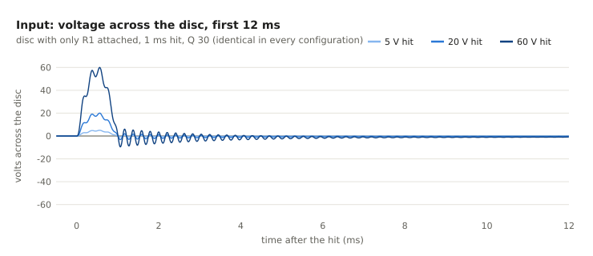

Same for every configuration: a fast spike that follows the force, then ringing at the
disc's 4.6 kHz resonance that dies out in a few ms at Q 30.

## Overall: reading and velocity vs hit strength

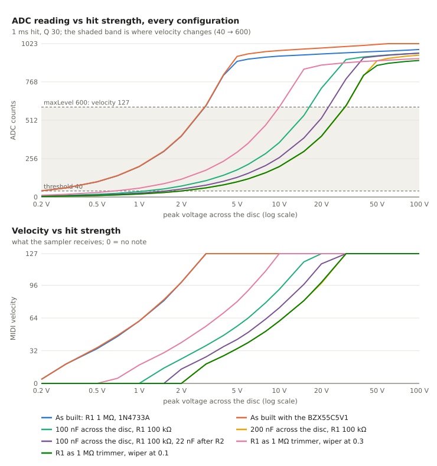

- **As built** (blue, orange on top of it) is very sensitive: 0.2 V already plays, 3 V
  is already velocity 127. Above ~4 V the zener squeezes every hit into 900–1000.
- **100 nF** (green) moves the same curve ~5× to the right; **200 nF** and the
  **trimmer at 0.1** (yellow, dark green, on top of each other) ~10×.
- Every curve flattens at 900–1000 counts: past its window, a configuration can't tell
  hits apart any more.

Velocity is `1 + 126 × x^0.6` with x = (reading − 40) / (600 − 40), so soft hits are
spread out more than loud ones.

## Detection and dead time

After a hit, the pad is deaf for 30 ms, then for 50 ms a new hit must read louder than
a threshold that starts at a quarter of the last hit's peak and falls to the base
threshold 40. After a hard hit (peak 947) as built:

| Second hit reads | Same hit across the disc | Plays if it comes at least … after the first note |
|---|---|---|
| 237 or more | 1.2 V or more | 30 ms |
| 200 | 1 V | 38 ms |
| 100 | 0.5 V | 59 ms |
| 41 | 0.2 V | 71 ms |

(Before tuning, with half the peak over 80 ms: 30 ms only from 2.3 V, and up to 103 ms.)

For scale: 16th notes at 120 bpm are 125 ms apart, 32nd notes 62 ms.

Each configuration below has a **detection test**: a hard 20 V knock, then a 4× softer
5 V knock 60 ms later, as the firmware sees them.

- As built, both play, but both at velocity 127: the zener squeezes the two hits to
  almost the same reading, and the accent is lost.
- In every configuration that reads hits proportionally, both play with their own
  velocity (100 nF: 116 then 41). With the old firmware values these second hits
  were all **missed**: 57 ms after the note the threshold was still at 33 % of the
  first peak.

A second effect shows up with sharp knocks: the firmware reads each pad every 0.2 ms,
and a 0.2 ms knock's peak is narrower than that. With 100 nF the 5 V knock peaks at 187
counts but the firmware's readings only caught 122. As built the zener flattens the
peak, so this doesn't happen. Expect some velocity jitter on very sharp hits with the
capacitor configurations.

## Firmware retrigger tuning

The retrigger rule fights two failures: set too high, a soft hit right after a loud one
is swallowed; set too low, the ringing or the zener tail of one hit plays a second
note. Every combination of `RETRIGGER_RATIO` (0.5 to 0.1), `DECAY_US` (80 to 15 ms)
and `MASK_US` (30 to 15 ms) was replayed on three boards, sampling at two different
phases:

- **36 single hits** per board (0.2/1/3 ms, Q 10/30/90, 5 to 100 V): each must give
  exactly one note, in both phases.
- **30 soft-after-loud pairs** per board: a 20 V hit, then one 2×, 4× or 10× softer,
  35 to 110 ms later. Pairs whose second hit is too soft to play even alone (200 nF,
  10× softer) don't count.

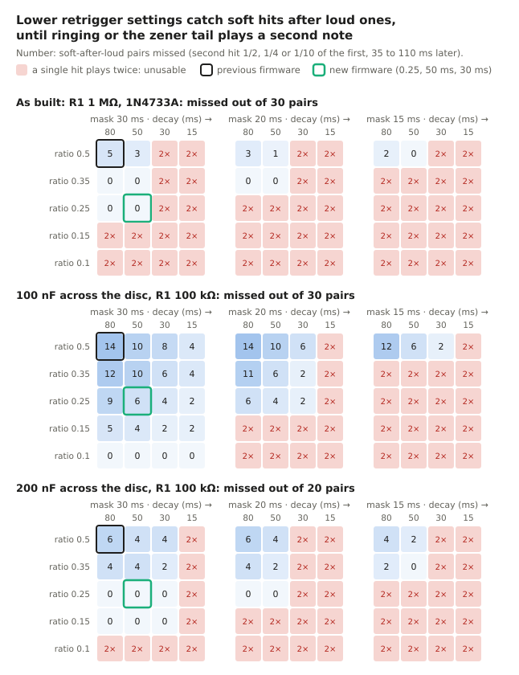

| Board | Missed pairs, old (0.5, 80 ms, 30 ms) | Missed pairs, new (0.25, 50 ms, 30 ms) | Double notes, new |
|---|---|---|---|
| As built | 5 of 30 | 0 | none |
| 100 nF across the disc | 14 of 30 | 6 (10× softer, within 60 ms) | none |
| 200 nF across the disc | 6 of 20 | 0 | none |

- **0.25, 50 ms, 30 ms** misses the fewest pairs of all the settings with no double
  notes on any board (0.25 with 80 ms comes next: 9 missed with 100 nF). It is now the
  default in `body808.ino`.
- **As built, it sits on the edge**: a 30 ms decay or a 0.15 ratio lets the zener tail
  of a sharp, hard, long-ringing hit (0.2 ms, Q 90) play a ghost note. If a pad plays
  ghost notes ~50 ms after hard hits, raise `DECAY_US` back to 80 ms or the ratio to
  0.35 (both still miss nothing as built).
- **Capacitor boards have no tail**, so they tolerate much lower values: 100 nF is
  clean down to a ratio of 0.1, which catches every pair.
- **The mask can't go lower as built**: 20 or 15 ms double-triggers at 0.25. Fast rolls
  stay limited to one hit every 30 ms per pad (33 per second).

Rerun with `python3 sim/tuning.py` (prints every combination's details).

---

## The configurations

Red in each schematic = what differs from the board as built.

### 1. As built: R1 1 MΩ, 1N4733A

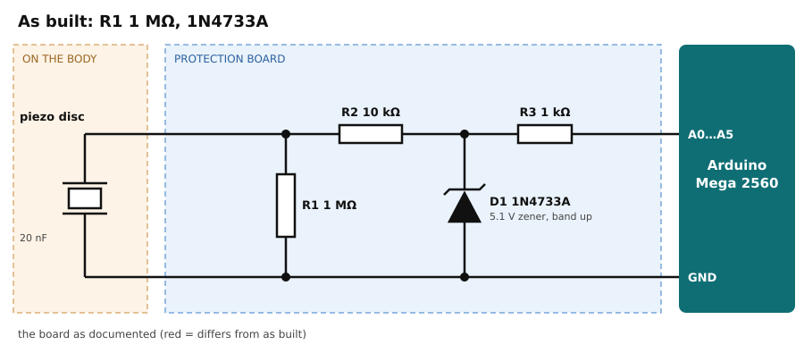

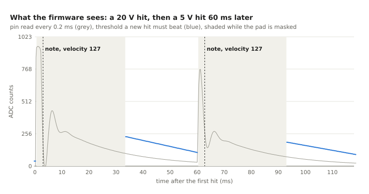

| Hit across the disc | 1 V | 2 V | 3 V | 5 V | 20 V | 100 V |
|---|---|---|---|---|---|---|
| ADC reading | 203 | 406 | 609 | 905 | 954 | 984 |
| Velocity | 61 | 99 | 127 | 127 | 127 | 127 |

Pin between −0.61 and 4.87 V up to 200 V hits; pin diode current 131 µA (26 % of the
budget); zener 45 mW of its 1 W.

The zener clips the disc's negative swings, which leaves the disc charged to 1–2 V
after a hard hit. That tail drains through R1 in ~50 ms, which is why the pin stays
above threshold for up to 61 ms. The decaying retrigger threshold stays above it, so
it never plays a note, but this tail is what limits the [retrigger
tuning](#firmware-retrigger-tuning): with a lower ratio or a shorter decay it plays a
ghost note ~35–60 ms after hard, sharp hits.

**Opinion:** the right board if your pads give less than ~3 V. It's the most sensitive
setup and the zener's flat top makes sharp knocks read reliably. If normal hits read
900+ in `CALIBRATE`, it plays almost everything at full velocity and you lose accents.

| Pros | Cons |
|---|---|
| simplest, already built and documented | velocity saturates above ~3 V across the disc |
| very sensitive: 0.2 V plays a note | loud hits all read 900–1000: no accents |
| more margin under the pin's limits than with the BZX55 | slowest tail (61 ms above threshold) |
| sharp knocks read reliably (flat peak) | |

### 2. As built with the BZX55C5V1

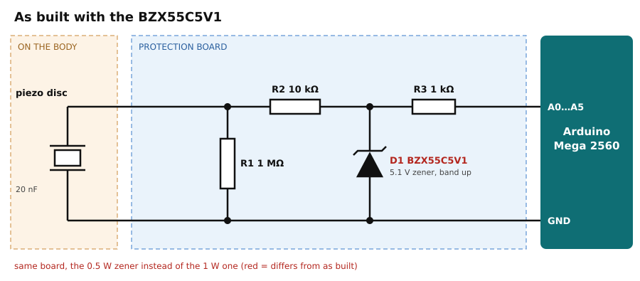

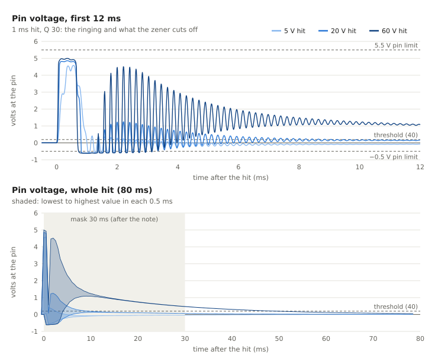

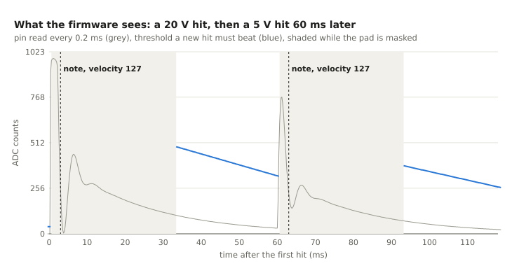

Same readings as the 1N4733A up to 4 V; above, a bit higher (938 instead of 905 at 5 V,
1023 from 60 V). Pin max 5.26 V on a 200 V hit (5.39 V for a part at the top of its
tolerance), pin diode current 360 µA.

**Opinion:** works, but no reason to prefer it. The extra counts sit above `maxLevel`
where velocity is already 127, and it leaves less margin. Use the 1N4733A.

| Pros | Cons |
|---|---|
| smaller (DO-35), easier on perfboard | 2.7× more current into the pin's diodes |
| holds closer to 5.1 V at small currents | pin max 5.26–5.39 V, close to the 5.5 V limit |
| | no velocity benefit |

### 3. 100 nF across the disc, R1 100 kΩ

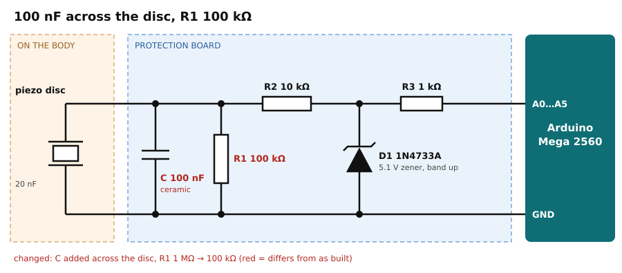

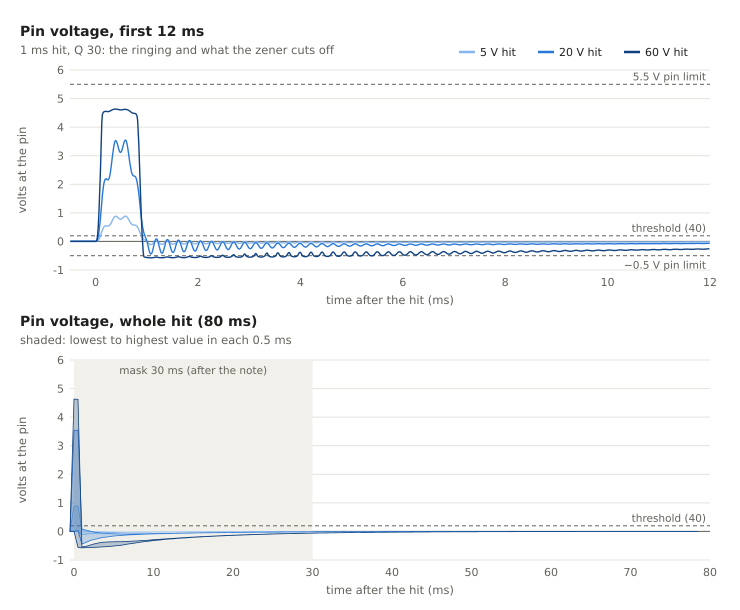

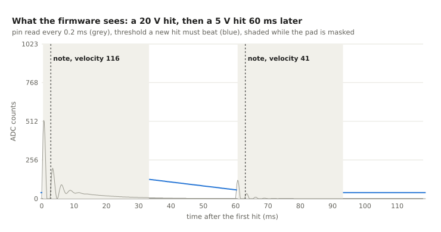

| Hit across the disc | 1 V | 2 V | 5 V | 10 V | 15 V | 20 V | 100 V |
|---|---|---|---|---|---|---|---|
| ADC reading | 36 (no note) | 73 | 181 | 363 | 544 | 726 | 960 |
| Velocity | – | 24 | 56 | 92 | 119 | 127 | 127 |

The capacitor and the disc share the hit's charge: 20 nF / (20 + 100 nF) ≈ 1/6 of the
voltage reaches the board. R1 drops to 100 kΩ to keep the same ~12–20 ms discharge.
The zener barely conducts on normal hits, so there is no positive tail; instead the pin
dips to about −0.5 V for 10–30 ms after a hit (safe: 94 µA into the pin's diodes).

**Opinion:** the best choice if your hits are strong. Proportional from 1 to 20 V, a
low-impedance source for the ADC, and two cheap parts per channel (100 nF ceramic
"104", a 100 kΩ from the resistor kit). With this board `RETRIGGER_RATIO` can go down
to 0.1 (simulated without any double note, and then even hits 10× softer right after
a loud one play); not with the board as built.

| Pros | Cons |
|---|---|
| velocity window 1.1–16 V, proportional up to 20 V | hits under ~1.1 V across the disc are ignored |
| low source impedance: the ADC reads correctly | sharp knocks: peak narrower than the 0.2 ms reading interval, some velocity jitter |
| zener and pin barely stressed (13 mW, 94 µA) | at 0.25, hits 10× softer within 60 ms of a loud one are dropped (0.1 fixes it) |
| shorter time above threshold (36 ms) | ±10–20 % ceramic tolerance: calibrate per pad |

### 4. 200 nF across the disc, R1 100 kΩ

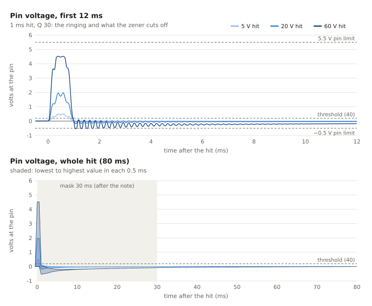

| Hit across the disc | 2 V | 3 V | 5 V | 10 V | 20 V | 30 V | 100 V |
|---|---|---|---|---|---|---|---|
| ADC reading | 40 (no note) | 61 | 101 | 202 | 404 | 607 | 946 |
| Velocity | – | 19 | 34 | 61 | 98 | 127 | 127 |

Two 100 nF in parallel. About 1/11 of the voltage reaches the board.

**Opinion:** for pads hit very hard (heel stomps), if they still read 900+ with 100 nF.
Too deaf for hand or chest pads.

| Pros | Cons |
|---|---|
| velocity window 2–30 V | hits under 2 V are ignored |
| least stress of the capacitor setups (7 mW, 81 µA) | same sharp-knock jitter as 100 nF |
| same parts, doubled | longer above threshold than 100 nF (44 ms, on 0.2 ms Q 90 knocks) |

### 5. 100 nF across the disc, 22 nF after R2

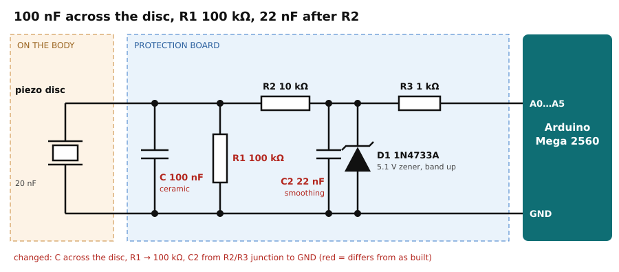

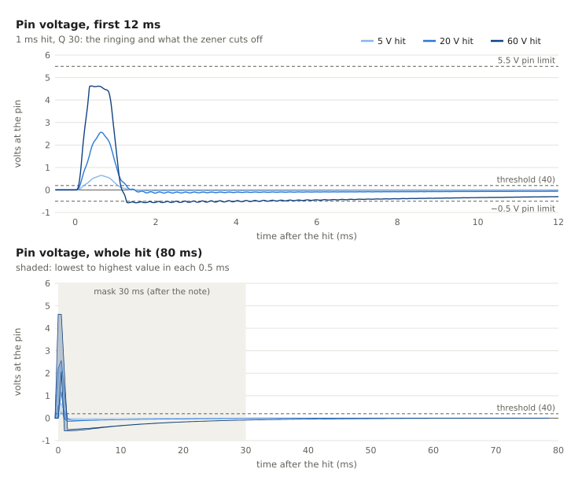

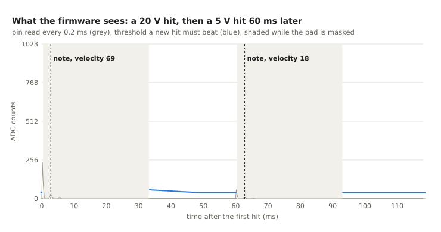

Tried to fix the sharp-knock jitter: C2 with R2 forms a 0.22 ms low-pass that stretches
the peak so the 0.2 ms readings can't miss it. It does stretch it, but it also
flattens short hits: the 20 V knock reads 241 instead of 518. Velocity then depends on
how *sharp* a hit is, not only how strong. Window for 1 ms hits: 1.5–22 V.

**Opinion:** not worth it. A smaller C2 (4.7 nF, 0.05 ms) might keep the stretch without
the loss; not simulated yet.

| Pros | Cons |
|---|---|
| shortest time above threshold (17 ms) | sharp knocks read half as loud |
| peak stretched: no missed peaks between readings | velocity depends on hit sharpness |
| very low source impedance at the pin | one more part per channel |

### 6. R1 as a 1 MΩ trimmer, wiper at 0.3

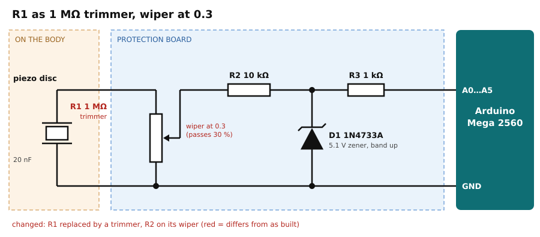

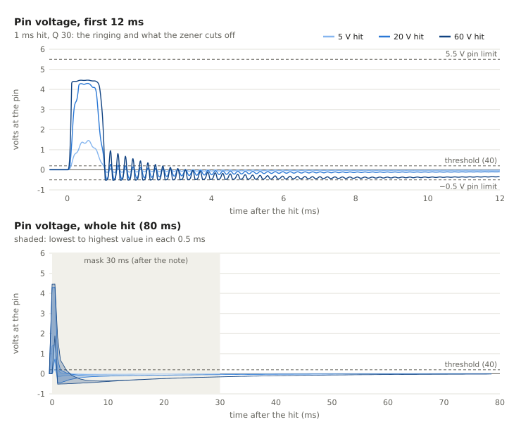

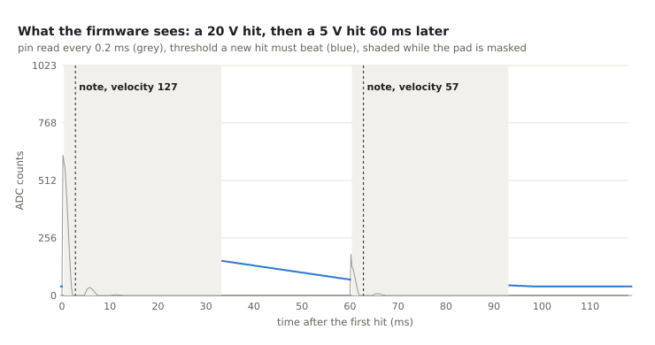

| Hit across the disc | 1 V | 2 V | 5 V | 8 V | 10 V | 100 V |
|---|---|---|---|---|---|---|
| ADC reading | 59 | 119 | 299 | 480 | 600 | 923 |
| Velocity | 18 | 40 | 80 | 110 | 127 | 127 |

The disc still sees 1 MΩ, so the pulse shape is unchanged; the wiper passes 30 %.

**Opinion:** handy on a breadboard to find the ratio each pad needs, but don't build
it in. Seen from the pin, the wiper is a ~210 kΩ source, far above the 10 kΩ the ADC
is designed for: the previous pad's voltage can leak into the reading, which this model
does not simulate. Once you know the ratio, use the capacitor that gives it.

| Pros | Cons |
|---|---|
| adjustable per pad | high source impedance (~210 kΩ): ADC crosstalk not modelled |
| one part replaces R1 | trimmers drift, 0.1 W / 50 V rating vs 100+ V spikes |
| least zener and pin stress (1 mW, 43 µA) | |

### 7. R1 as a 1 MΩ trimmer, wiper at 0.1

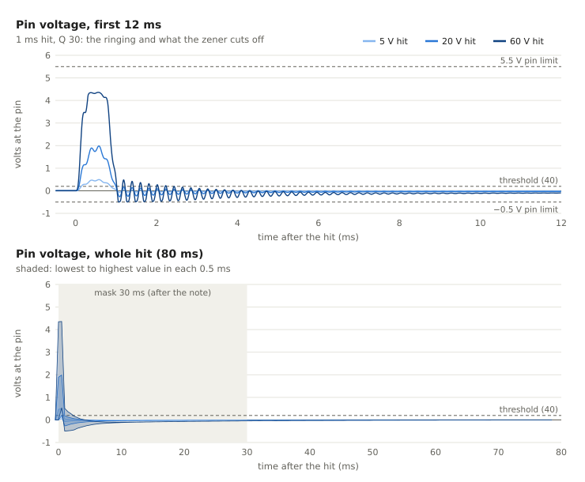

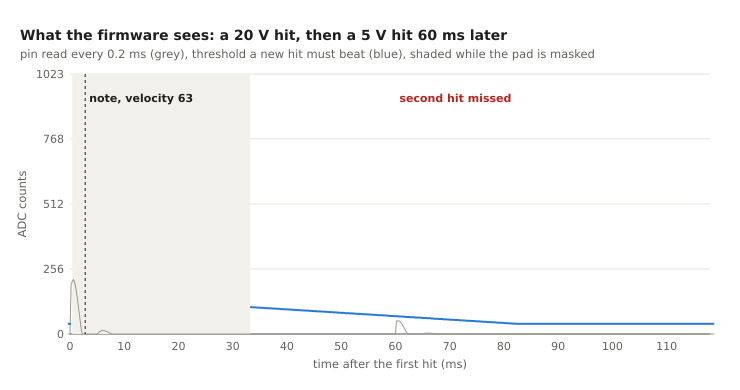

Same window as 200 nF (2–29 V), with a lower source impedance (~90 kΩ) than at 0.3,
still 9× the ADC's 10 kΩ.

**Opinion:** same as above: a tool to find the ratio, not the final board.

| Pros | Cons |
|---|---|
| window 2–29 V, adjustable | still ~90 kΩ source impedance |
| short time above threshold (19 ms) | same drift and voltage-rating concerns |

---

## Recommendation

1. Build one channel as documented (configuration 1, 1N4733A).
2. Run `CALIBRATE 1` and note the readings of soft and hard hits on each pad.
3. Readings mostly below 900 → keep it. Hard hits pinned at 900–1000 → add 100 nF
   across the disc and change R1 to 100 kΩ (configuration 3); 200 nF for the kick pad
   if it still saturates.
4. The firmware's retrigger settings (0.25, 50 ms) suit every configuration. With
   configuration 3 only, `RETRIGGER_RATIO` 0.1 catches even softer follow-up hits.

## Limits

- The disc's hit strength and ringing on your pads are guesses until a `CALIBRATE`
  capture replaces them.
- The zener's knee at small currents is a typical curve. Measuring yours takes a 9 V
  battery and a resistor ([sim/README.md](../sim/README.md)).
- Not simulated: crosstalk between pads (through the body or the ADC multiplexer), the
  ADC's sample-and-hold with high-impedance sources, the radio link.
