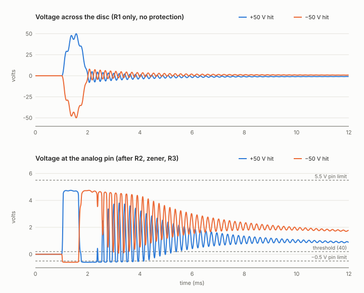
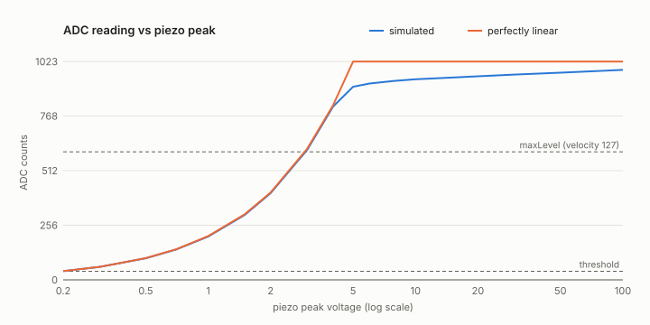

# Circuit simulation

> The full report, with a schematic, waveforms and detection test for each tested
> board configuration, is [docs/simulation.md](../docs/simulation.md). It is drawn by
> `python3 sim/report.py`. This page covers the models, their sources, and `run.py`.

ngspice simulations of a piezo hit going through the protection board into the
Mega's analog pin. They check that the pin survives any hit, what the ADC reads, and
that the firmware plays exactly one note per hit.

```
python3 sim/run.py            # full sweep, ~10 min: Markdown tables on stdout, SVG plots in sim/out/
python3 sim/run.py --quick    # fewer points
ngspice sim/hit.cir           # one hit, interactive, with plots
```

Needs `ngspice` (Gentoo: `emerge sci-electronics/ngspice`). No Python packages.

## Results (1N4733A, 27 mm disc, default firmware settings)

**The pin survives.** Hits from 1 V to 200 V across the disc, both polarities: the
current into the chip's own protection diodes stays under 131 µA (the budget in
[hardware.md](../docs/hardware.md) is 0.5 mA), the zener sees at most 45 mW of its 1 W.
The pin dips to −0.6 V on negative swings, past the −0.5 V rating; that's expected and
R3 keeps the current small. Zener ±5 %, disc ±30 % and a 2 m cable change nothing
that matters.

**One note per hit.** The pin voltage of each simulated hit, replayed through the
firmware's detector (0.2 … 3 ms hits, Q 10 … 90, 5 … 60 V), always gives exactly one
Note On. The firmware needs its decaying retrigger threshold for this, the 30 ms mask
alone isn't enough: on short, hard hits the zener clips the disc's negative swings,
leaving it charged to ~1–2 V, and that drains through R1 in ~50 ms.



**Velocity only works between 0.2 V and ~3 V across the disc.** That's 40 to 600
counts (`threshold` to `maxLevel`); above ~4 V the zener caps the reading at 900–1000
counts whatever the force. Hard hits on discs are reported at 10–50 V, so if your pads
reach that, every firm hit plays velocity 127 and raising `maxLevel` only gains a few
steps. Check in `CALIBRATE` mode: if normal hits already read 900+, the pad needs
attenuation before the zener (to simulate first: a capacitor across the disc divides
the voltage without changing the pulse's shape).



### If your hits are too strong: reduce the signal before the zener

Two ways to shift the velocity window up, both simulated with the 1N4733A. Both keep
the pin safe (pin diode current under 100 µA) and give one note per hit; they also
shorten the slow tail, since the zener barely conducts any more.

| On the board | Velocity range (ADC 40 → 600) | Linear up to |
|---|---|---|
| as built: R1 1 MΩ | 0.2 – 3 V | 4 V |
| **100 nF across the disc, R1 100 kΩ** | 1.1 – 16 V | 20 V |
| **200 nF across the disc, R1 100 kΩ** | 2 – 30 V | 30 V |
| R1 as a 1 MΩ trimmer, wiper at 0.3 | 0.7 – 10 V | 12 V |
| R1 as a 1 MΩ trimmer, wiper at 0.1 | 2 – 30 V | 35 V |

The **capacitor** is the better choice: the disc plus capacitor make a low-impedance
source, so R1 drops to 100 kΩ to keep the same ~20 ms discharge time. The **trimmer**
is adjustable per pad, but its wiper is a high-impedance source (up to 250 kΩ), far
above the 10 kΩ the ADC is designed for: the previous channel's voltage can leak into
the reading. The model doesn't simulate that, so prefer the capacitor.

```
python3 sim/run.py --r1 100e3 --cpar 100e-9    # capacitor divider
python3 sim/run.py --wiper 0.3                  # trimmer
```

**Polarity matters for soft hits.** A disc whose first swing is negative only reads
through its rebound: a −1 V hit reads 93, a +1 V hit 203. From ~10 V up both read the
same.

## The models (`body808.lib`)

### Piezo disc: Butterworth–Van Dyke

```
        ┌──────── C0 ────────┐
 red ───┤                    ├─── black
        └─ RM ─ LM ─ CM ─ F ─┘
```

The usual lumped model of a piezo element. C0 is the disc's capacitance; RM, LM and
CM are its mechanical resonance seen from the electrical side. The hit is a force F
in the resonant branch, so the ringing comes out of the model, not from a
hand-drawn sine.

| Parameter | Value | Source |
|---|---|---|
| C0 | 20 nF (±30 %) | Timesetl listing (the discs used): 20 nF ±30 % at 1 kHz, same as Murata 7BB-27-4 |
| Resonance F | 4.6 kHz (±0.5 kHz) | Timesetl listing, Murata 7BB-27-4 |
| CM | C0 / 10 | typical coupling for buzzer discs (not on datasheets) |
| Q | 10 … 90, default 30 | bare disc ~90 (200 Ω resonant resistance); glued to a plate and padded with foam it's lower |
| Hit | force half-sine, 0.2 … 3 ms | hard knock is short, a padded stomp longer |
| Hit strength | 1 … 200 V peak across the disc | measured online: 35 mm discs give 0–50 V, a hard drum hit −50 V / +12 V, > 60 V peak-to-peak |

Hit strength is given as the peak voltage across the disc with only R1 connected,
what a scope on the jack would show without the rest of the board.

### Zener: 1N4733A or BZX55C5V1

Both work. Compared on the same hits:

| | 1N4733A (1 W) | BZX55C5V1 (0.5 W) |
|---|---|---|
| pin max on a 200 V hit | 4.87 V | 5.26 V (5.39 V at its +tolerance, 100 V hit) |
| worst pin diode current | 131 µA | 360 µA |
| ADC on a 10 V hit | 940 | 977 |

The BZX55 holds closer to 5.1 V at the small currents the circuit uses, so it reads a
bit higher on loud hits, but those are beyond `maxLevel` anyway. The 1N4733A keeps
more margin on the pin. `python3 sim/run.py --zener BZX55C5V1` runs everything with it.

#### 1N4733A (5.1 V, 1 W)

The 1N4728A–1N4756A kit. Datasheet: 5.1 V at 49 mA, Zzt ≤ 7 Ω, Zzk ≤ 550 Ω at 1 mA,
leakage ≤ 10 µA at 1 V. The circuit runs it far below its 49 mA test current, where the
datasheet says little: the model's knee (about 4.7 V at 1 mA, 4.3 V at 10 µA) is a
typical guess. **Measure yours** with a 9 V battery, a resistor and a multimeter
(band towards +, measure across the zener):

| Resistor | Current | Model says |
|---|---|---|
| 1 kΩ | 4.2 mA | 4.80 V |
| 10 kΩ | 0.44 mA | 4.62 V |
| 100 kΩ | 46 µA | 4.44 V |
| 1 MΩ | 4.7 µA | 4.26 V |

The BZX55C5V1 model is the same junction on a ~10× smaller die (datasheet: 5.1 V at
5 mA, Zzt ≤ 60 Ω); it should read about 0.2 V higher than the table (0.3 V with the 1 kΩ).

If your readings differ by more than ~0.1 V, adjust `BV` (shifts the whole curve) or `NBV`
(how fast the voltage drops at low current) in `body808.lib` and `ZENER_MODEL` in `run.py`.

### Analog pin: ATmega2560

Clamp diodes to 5 V and GND, 10 pF pin capacitance, and the ADC's 14 pF
sample-and-hold behind ~1 kΩ (datasheet "Analog Input Circuitry").

## Sources

- [Murata 7BB-27-4 datasheet](https://www.farnell.com/datasheets/3797182.pdf)
- [PUI AB2746B](https://www.digikey.lt/en/products/detail/pui-audio-inc/AB2746B/1464752), [ABLF2746B](https://www.digikey.es/en/products/detail/pui-audio-inc/ABLF2746B/21278410)
- [Simulate piezo disk input, LTspice forum](https://forum.qorvo.com/t/simulate-piezo-disk-input/20830): measured hits, decaying sine model
- [Cornell ECE4760 Taiko trainer](https://people.ece.cornell.edu/land/courses/ece4760/FinalProjects/f2012/asj42_gs368_ln226_awh49/asj42_gs368_ln226_awh49/index.html): −50 V / +12 V measured on a hit
- [Dependence of piezo disc impedance on mechanical loading](https://www.ncbi.nlm.nih.gov/pmc/articles/PMC8914625/)
- [onsemi 1N4733A](https://www.digikey.bg/en/products/detail/onsemi/1N4733A/977210)
